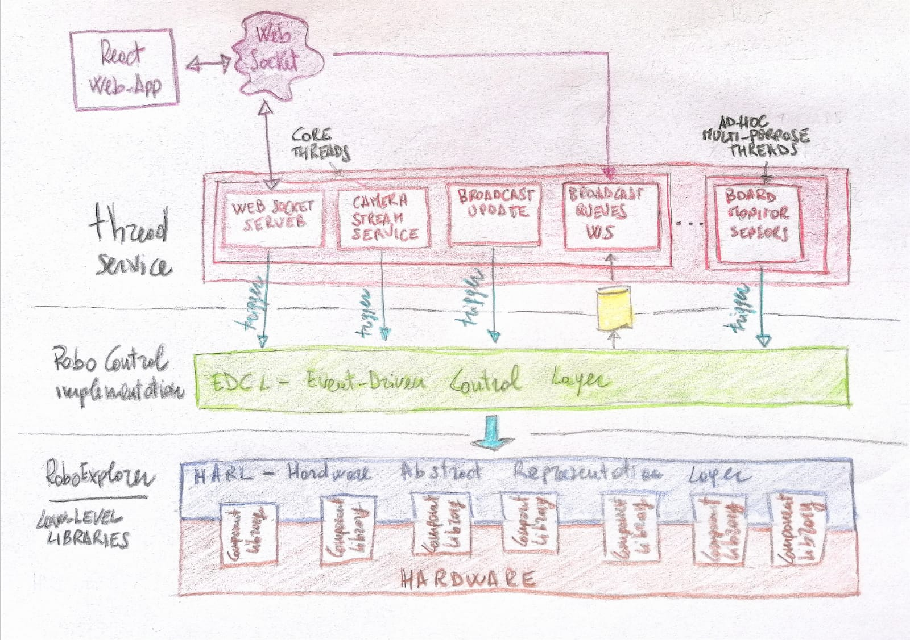

# PYTHON EVENT-DRIVEN FRAMEWORK

A simple python event-driven architecture to control small appliances such as robot and IOT boards. 

It includes libraries for various sensors and a 
communication protocols that enables connections with other devices. 

A simple react web-based application collects and monitor your IOT board

## The Architecture - The main components

The framework is build around three layers. Each layer implements a setof API used to masquerate the layer below and to release a more comprehensive and intuitive interfaces. 
The three layers are:

 1. **High-level- Thread Services:**  defines service threads used to gather data and recursive operations 
 2. **Medium-level- RoboControl Implementation:** implements controls and artificial intelligence layer
 3. **Low-level- Hardware abstract:** masquerates hradware component libraries in a set of APIs



The external communication is implemented using a **WebSocket Server**. 
The socket connection provides a simple channel where the board sends data and receives instructions.

A built-in **Web-Application** simplifies connection and monitoring.


### The class diagram

The following class diagram shows how the framework implements the underlined architecture. 
This picture identifies connections and relations between classes at every architecture level.


 
In a simple description the low-level components (ex. RoboMotors, RoboServos, distance and temperature sensors) 
are wrapped in the RoboExplorer component. RoboExplorer is actually the abstract view of your board/robot and defines all APIs used to control it.

RoboExplorer is controlled by the RoboControl. This class is an implementation of the abstract class ABC_RoboControl.
The RoboControl defines the logic of your board/robot and is fully customizable. 
At this stage the component complexity is defined by the end-user,
your RoboControl implementation can contain mathematical models, artificial intelligence or a simple on-off button.

RoboControl extends the registrable class enabling the component to support event-driven calls.

### The event-driven solution

A real-time solution requires that actions are taken on the bases of received events. 
This approach allows an application to promptly response to every external change. 
Think about a the distance sensor that detects an obstacle and the board needs to immediately stop motors or 
a temperature sensor that detects high temperature that requires fan to be activated.
 
All these cases requires a framework with built-in event controls APIs.

This framework implements event controls by leveraging the observer pattern. 

The following schema defines how an event triggers an action on the RoboControl component

1. RoboControl extends the Registrable class. It inherits two methods: register_observer and register_receiver
2. The "Board monitor sensor thread" initialises an Observer object. 
This object uses the register_observer and register_receiver method to register a RoboControl method.
3. The registered method is called every time the Observer object emits a message.

This simple pattern allows events to be promptly passed from the high-layer to the medium-layer. 
The RoboControl logic defines interactions with the low-layer.

## How I can start using the framework

Integrate the framework in your development is really simple. Follow the four steps and enjoy building your device!

1. **Wrap Component library**: this manages the component library
2. **RoboExplorer:** this is strictly connected to your board/robot. here you have to wrap all your sensors and actuators.
3. **RoboControl:** this is the funniest part. Define how your board/robot interacts with the external world by implementing your own RoboControl
4. **Thread:** create a thread to produce events

Additionally you can start new threads that gather data from all your sensors

This repository contains an example of a raspberry PI board with 2 motors, 2 servos and a distance sensor.

## The react web-based application
The built-in web application allow you to monitor and control your board. 
The web application starts with the framework at the port 3000.


## Example 1: how to connect a distance sensor

This example shows how to connect and use a distance sensor.

**PRE REQUISITE:** your have installed a sensor distance in the board/robot (Ex. HC-SR04)

Follow the main 4 implementing steps:

**1. Wrap component library:**

HC-SR04 is wrapped in the class ``library/ultrasonic/RoboUltraSonic.py``
(if your sensor is not compatible, extend/implement a new class with your own distance library). 
Add and Initialise your distance sensor in the ``library/ultrasonicsensors.py`` array.

**2. Define your RoboExplorer:**

Creare your robot definition as the pre-defined RoboExplorer Object (``/library/robot/RoboExplorer.py``). 
Following an example of how your can create a Robot with a single distance sensor.

````
from library.ultrasonic.ultrasonicsensors import ultra_sonic_sensors

class RoboExplorer:
    
    def __init__(self):
        self.__ultrasonicsensor = ultra_sonic_sensors[0]
   
    def get_distance(self):
        distance = self.__ultrasonicsensor.get_distance()
        return distance
    
    def close(self):
        self.__ultrasonicsensor.close()
````

**3. Create the logic. the RoboControl object**

Extend the RoboControl abstract class by creating your own logic. This class contains the code that runs for every single event.
Following an example of a callback method that will be triggered by a new event.

````
from library.queue.RoboQueues import RoboQueues
from library.events.DistanceEvent import DistanceEvent

class RoboControl_EasyMove(RoboControl):

    def __init__(self, roboExplorer:RoboExplorer, roboQueues:RoboQueues):
        super().__init__();
        self.roboExplorer = roboExplorer
        self.roboQueues = roboQueues
        pass
        
     def on_distance_sensor(self, data:DistanceEvent):
        print(str(data))
````

**4. Generate distance events. Create your thread.**
Thread are used to run part of codes concurrently. this example shows how we interact with the distance sensor library
and trigger the callback distance method (on_distance_sensor) every time a new reading is ready.

````
async def th_ultrasonicsensor(robotControl:RoboControl):
    # register sensor observer in robot control
    ultrasonicSensorObserver = Observer()
    robotControl.register_observer(ultrasonicSensorObserver, robotControl.on_distance_sensor)
    while True:
        try:
            distance = ultra_sonic_sensors[0].get_distance()
            ultrasonicSensorObserver.emit =  DistanceEvent(True, distance, direction)
            await asyncio.sleep(3)
````
_Line 1:_ a new async function (th_ultrasonicsensor) with the argument ``robocontrol`` is defined.

_Line 3-4:_ a new ``Observer`` is created and the method ``roboControl.on_distance_sensor`` is registered within the ``Observer``

_Line 5-7:_ an infinite loop starts and call the get_distance method 

_Line 8:_ the Observer emits a new message and trigger the registered callback (roboControl.on_distance_sensor) 
that starts the execution

_Line 9:_ the code waits 3 secs

## How to start the framework

Create new virtual env

````
pip install virtualenv
virtualenv env -p python3.7
source env/bin/activate
````
Install libraries
````
pip install -r requirements.txt
````